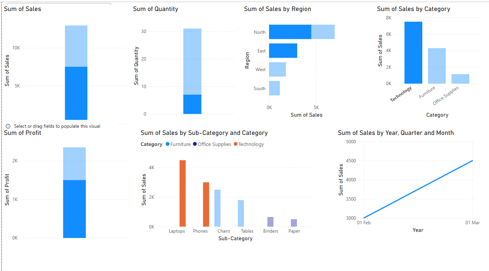

# Sales Performance Dashboard (Power BI)

This project presents a Sales Performance Dashboard built in Power BI using a fictional e-commerce dataset.

## 🔧 Tools Used
- Power BI
- Excel

## 📊 Dashboard Features
- Total Sales and Profit KPIs
- Monthly Sales Trend Line
- Sales by Region
- Top Products by Sales
- Filters for Category, Region, Segment

## 📁 Dataset
The data used is a fictional sample dataset with fields like Order Date, Sales, Profit, Category, Sub-Category, Region, and Segment.

## 🎯 Objective
To showcase data visualization skills in Power BI and deliver actionable insights from sales data.

## 📸 Preview

---

**Created by Netra Sunil Darge**
